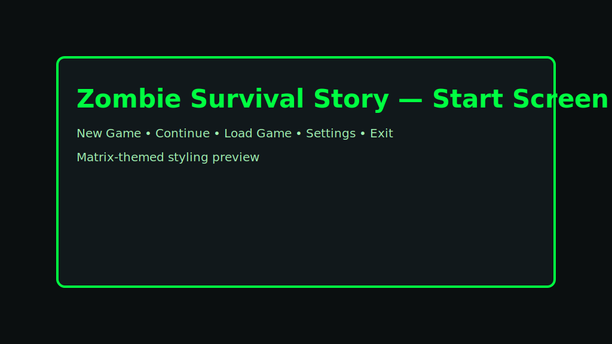
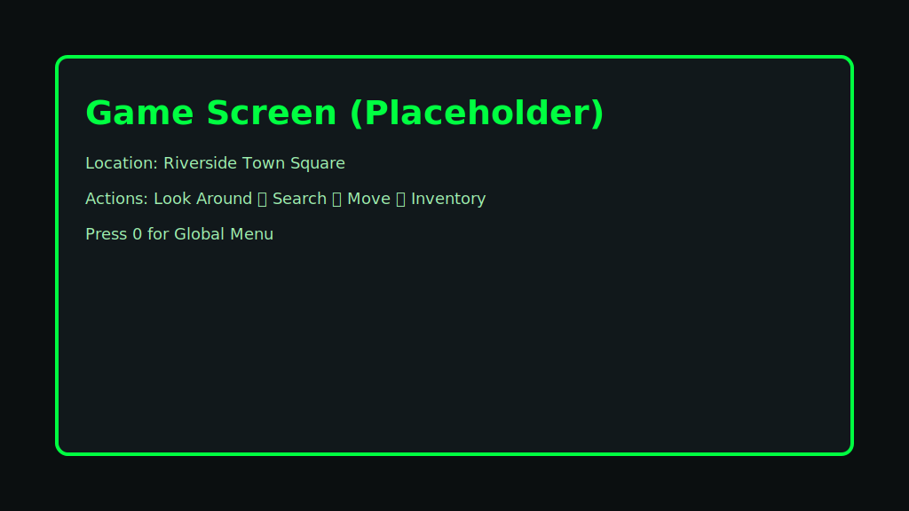
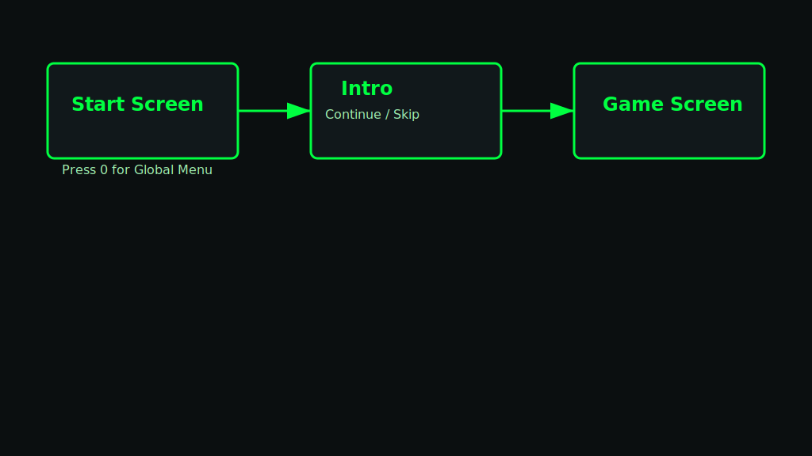

# 🧟 Zombie Survival Story (Flutter)

A text-based survival game built with Flutter and Dart. This README walks absolute beginners through installing Flutter, setting up your environment, and running the game in a web browser (Chrome).

---

## 1) What you need (Beginner-friendly)

- Flutter SDK (includes Dart)
  - Download: https://docs.flutter.dev/get-started/install
  - Flutter already bundles Dart; you don’t need to install Dart separately.
- A web browser (Google Chrome recommended)
- Git (for cloning the repo): https://git-scm.com/downloads
- Optional editor: VS Code (https://code.visualstudio.com/) or Android Studio

Tip: After installing Flutter, add the Flutter bin folder to your PATH so you can run `flutter` from a terminal.

---

## 2) Install Flutter and check your setup

1. Install Flutter for your OS using the official guide above.
2. Open a new terminal and run:
   ```bash
   flutter doctor
   ```
   - Fix anything Flutter recommends (it will show missing tools or permissions).
3. Enable web support (if not already enabled):
   ```bash
   flutter config --enable-web
   flutter devices
   ```
   You should see a Chrome device listed.

---

## 3) Get the project

```bash
# Clone the repository
git clone <REPO_URL>
cd text-survival-game

# Fetch packages
flutter pub get
```

If you previously ran the project on an old Flutter version, it can help to clean first:
```bash
flutter clean
flutter pub get
```

---

## 4) Run in your browser (Chrome)

```bash
# Option A: Dev server (hot reload)
flutter run -d chrome --web-port=8083

# Option B: Build for the web
flutter build web
# The output will be in build/web (you can serve it with any static server)
```

- When using Option A, Flutter will open Chrome automatically (or you can open http://localhost:8083).
- Use `r` in the terminal for hot reload and `R` for hot restart.

---

## 5) Controls and basic flow

- Start the app → New Game → choose Difficulty (Easy/Medium/Hard)
- Intro screen → Continue/Skip → Game screen
- Press `0` any time for the Global Menu (Status, Inventory, Save, Load, Help, Settings, Go Home)
- Settings let you toggle Dark/Light theme (persists between sessions)

---

## 6) Common issues (and quick fixes)

- “The type 'JSObject' can’t be used as supertype” when targeting web
  - Cause: Old version of the `web` package after upgrading Flutter.
  - Fix:
    ```bash
    flutter pub upgrade
    flutter clean
    flutter pub get
    ```

- Chrome device not detected
  - Ensure web is enabled: `flutter config --enable-web`
  - Verify Chrome is installed and in PATH; run `flutter devices`

- Port is already in use
  - Use another port: `flutter run -d chrome --web-port=8084`

- Analyzer warnings after upgrade
  - We’ve migrated deprecated APIs (e.g., `withOpacity()` → `withValues(...)`, `MaterialStatePropertyAll` → `WidgetStatePropertyAll`) so `flutter analyze` should show no issues. If you see new ones after a Flutter upgrade, run `flutter analyze` and update per messages.

---

## 7) Project structure (Flutter)

```
lib/
  main.dart                # App entry point
  constants/app_theme.dart # Centralized theme (dark/light)
  models/                  # Game models (GameState, etc.)
  services/                # Game logic (engine, combat, save, story)
  screens/                 # UI screens (start, intro, game, combat, inventory, settings)
  widgets/                 # Reusable UI components (buttons, dialogs, status bar)
assets/
  locations.json           # Location graph and metadata
  zombie_intro.txt         # Intro text
  opening_title.txt        # (Not used for ASCII in UI; story text still present)
web/                       # Web bootstrap files (index.html, manifest)
```

---

## 8) Recommended tools

- VS Code + Flutter extension: https://marketplace.visualstudio.com/items?itemName=Dart-Code.flutter
- Android Studio + Flutter plugin: https://developer.android.com/studio
- Flutter docs: https://docs.flutter.dev/
- Dart language: https://dart.dev/

---

## 9) Contributing & development tips

- Run static checks: `flutter analyze`
- Quick web run: `flutter run -d chrome`
- Hot reload: save file → press `r` in the run terminal
- Logging: use `debugPrint()` in Dart
- Theming: change colors in `lib/constants/app_theme.dart`
- Locations: update `assets/locations.json`; ensure nearby routes are consistent and symmetric within towns

---

## 11) Add Flutter to your PATH (so `flutter` works in any terminal)

- Windows (recommended: GUI method)
  1. Install Flutter (e.g., extract to `C:\src\flutter`)
  2. Open: Start → “Environment Variables” → “Edit the system environment variables” → “Environment Variables…”
  3. Under “User variables” (or “System variables”), select `Path` → Edit → New → add `C:\src\flutter\bin`
  4. Click OK on all dialogs, then close and reopen your terminal
  5. Verify:
     ```powershell
     flutter --version
     flutter doctor
     ```
  - PowerShell (advanced; beware of long PATH truncation with `setx`):
    ```powershell
    [Environment]::SetEnvironmentVariable("Path", $env:Path + ";C:\\src\\flutter\\bin", "User")
    # Restart your terminal afterwards
    ```

- macOS / Linux (bash/zsh)
  1. Extract Flutter to a folder, e.g., `~/flutter`
  2. Add Flutter to PATH in your shell rc file:
     ```bash
     echo 'export PATH="$PATH:$HOME/flutter/bin"' >> ~/.bashrc   # or ~/.zshrc
     source ~/.bashrc   # or: source ~/.zshrc
     ```
  3. Verify:
     ```bash
     flutter --version
     flutter doctor
     ```

---

## 12) VS Code one‑click run (launch.json)

- Install VS Code + Flutter extension
- Open this folder in VS Code
- Create `.vscode/launch.json` with the following content (already included in this repo if you see the file):

```json
{
  "version": "0.2.0",
  "configurations": [
    {
      "name": "Web (Chrome, 8083)",
      "request": "launch",
      "type": "dart",
      "program": "lib/main.dart",
      "args": ["-d", "chrome", "--web-port=8083"]
    }
  ]
}
```

- Now press F5 (or Run → Start Debugging) to launch the app in Chrome on port 8083

---

## 13) Screenshots / GIFs

We include placeholder SVGs so the README shows images out of the box. Replace them with real screenshots/GIFs when ready.

- `docs/start-screen.svg`
- `docs/game-screen.svg`
- `docs/flow.svg`

Embedded below:





---

## 10) License

MIT License. See LICENSE file if present, or include your preferred license.

---

Happy surviving! 🧟‍♂️


---

## 14) Automated screenshots and UI tests

This project includes two complementary options:

- Integration screenshots (end-to-end): drives the app and saves PNGs under `screenshots/`.
- Golden tests (pixel regression): fast, deterministic snapshots for widgets/screens.

### A) Integration screenshots (Web/Chrome)
Prereqs: Chrome installed; web support enabled (`flutter config --enable-web`).

Windows helper script (starts ChromeDriver on :4444):
```powershell
# From repo root
powershell -ExecutionPolicy Bypass -File scripts/launch_chromedriver.ps1
```

Run the tests:
```bash
flutter drive \
  --driver=test_driver/integration_test.dart \
  --target=integration_test/app_flow_test.dart \
  -d web-server \
  --browser-name=chrome
```
- Output: PNG files in `screenshots/` (e.g., `01-start.png`, `02-difficulty.png`, `03-intro_or_game.png`, `04-settings_dark.png`, `05-settings_light.png`, `06-start_after_settings.png`).
- Tip: Commit selected screenshots into `docs/` for the README if desired.

### B) Golden tests (pixel-regression)
- Update goldens (first run or when UI intentionally changes):
Note: If Chrome is not in PATH on Windows, set the environment variable `CHROME_EXECUTABLE` to your Chrome path, e.g. `C:\\Program Files\\Google\\Chrome\\Application\\chrome.exe`.


```bash
flutter test --tags=golden --update-goldens
```
- Run a single golden test file:
```bash
flutter test test/golden/start_screen_golden_test.dart
```
Artifacts:
- Baseline PNGs are stored next to the test (via golden_toolkit).
- Failure diffs appear under a local `failures/` folder (already gitignored).

### C) CI automation (GitHub Actions)
This repo includes a workflow that runs golden tests and web integration screenshots on every push. Screenshots are uploaded as CI artifacts.

Why both?
- Integration screenshots are great for docs and full app flows.
- Golden tests are fast and catch accidental UI regressions early.
